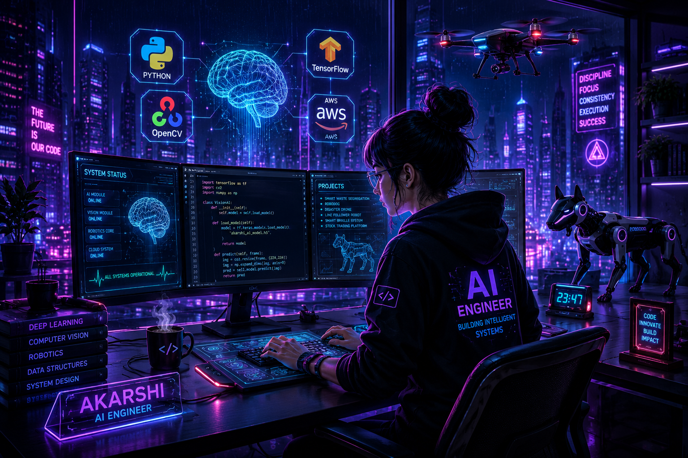

<div align="center">




<br>


<br>


</div>

---

#  ABOUT ME

<div align="center">

<div align="left" style="width:fit-content; margin:auto;">

## 👋 Hi, I'm **Akarshi Srivastava**

### AI & Robotics Engineer • Computer Vision Developer • ML Enthusiast


</div>

</div>

</div>

<br>

<table>

<tr>

<td width="50%" valign="top">

## 🚀 What I Do

- 🤖 Develop AI-powered Robotics
- 👁️ Build Computer Vision Systems
- 🧠 Train Deep Learning Models
- 💻 Create Full Stack Applications
- ☁️ Explore Cloud & Edge AI
- ⚡ Solve Real-World Engineering Problems

</td>

<td width="50%" valign="top">

## ⚡ At A Glance

🎓 **B.Tech CSE (AI & ML)**

🤖 **AI & Robotics Developer**

🏆 **Multiple National Robotics Winner**

🚁 **AIR 4 – NIDAR Drone Competition**

💡 **Passionate about Intelligent Automation**

🌱 **Currently learning AWS & Advanced AI**

</td>

</tr>

</table>

---

<div align="center">

## 🛠️ CURRENT TECH STACK


</div>

---

<div align="center">

## 💭 Engineering Philosophy

> **"I enjoy building intelligent systems where Artificial Intelligence, Computer Vision, Robotics and Software Engineering come together to solve real-world challenges."**

</div>

---

<div align="center">

| 🎯 Focus | 🚀 Goal |
|:---------|:-------|
| Artificial Intelligence | Build practical AI solutions |
| Computer Vision | Enable machines to understand images |
| Robotics | Create autonomous systems |
| Full Stack Development | Build complete AI-powered products |
| Cloud Computing | Deploy scalable intelligent applications |

</div>

---


# ⚙ TECHNOLOGY MATRIX

<div align="center">

### 👨‍💻 Programming Languages


<br><br>

### 🧠 Artificial Intelligence & Machine Learning


<br>


<br><br>

### 🤖 Robotics & Embedded Systems


<br>


<br><br>

### 🌐 Web Development & Cloud


</div>

---

# 📊 AI SKILL MATRIX

```text
Artificial Intelligence        ████████████████████ 100%
Machine Learning               ███████████████████░ 96%
Computer Vision                ██████████████████░░ 92%
Robotics                       █████████████████░░░ 88%
Embedded Systems               ████████████████░░░░ 84%
Backend Development            ████████████████░░░░ 83%
AWS Cloud                      ███████████████░░░░░ 78%
```

---


# 🚀 Featured Projects

<div align="center">

<a href="https://github.com/Akarshi27?tab=repositories">


</a>

</div>

---


# 🏆 HALL OF ACHIEVEMENTS

<div align="center">

> **"Every competition represents a solved engineering challenge."**

</div>

<br>

<div align="center">

| 🏅 Competition | 🏆 Achievement |
|:---------------|:--------------|
| 🚁 Technoxian Robotics Championship | 🥇 1st Position |
| 🚁 Saturnalia • Thapar University | 🥇 1st Position |
| 🚁 NIDAR National Drone Competition | 🎯 AIR 4 |
| 🤖 INNOTECH | 🏆 Department Winner |
| 🏁 IIT Delhi Robotics Competition | 🥇 Winner |
| ♻️ Orbix • IIIT Delhi | 🥈 Runner-up |
| ♻️ HackHeist • GDG MIET | 🥉 3rd Position |
| 💳 RBI × IIT Delhi Challenge | 📜 Phase 2 Qualifier |
| 🌍 KIET Model United Nations | 🇩🇪 Germany Delegate |

</div>

---

# 📜 CERTIFICATION VAULT

<div align="center">

<table>

<tr>

<td align="center" width="33%">


### AWS Academy

Cloud Foundations


</td>

<td align="center" width="33%">


### AWS Academy

Machine Learning Associate


</td>

<td align="center" width="33%">


### Infosys Springboard

Java Programming


</td>

</tr>

</table>

</div>

---
# 👤 PROFILE OVERVIEW

<div align="center">


</div>

<br>

# 📊 GitHub Analytics

<div align="center">


</div>

<div align="center">


</div>


---
# 📈 CONTRIBUTION GRAPH

<div align="center">


</div>

---

# 🐍 CONTRIBUTION SNAKE

<div align="center">


</div>

---

# 🌐 CONNECT

<div align="center">

<a href="mailto:akarshisrivastava2711@gmail.com">

</a>

<a href="https://www.linkedin.com/in/akarshi-srivastava-a74396328/">

</a>

<a href="https://github.com/Akarshi27">

</a>

</div>

---

<div align="center">

## ⚡ BUILDING INTELLIGENT MACHINES THAT CAN SEE • THINK • ACT


</div>
